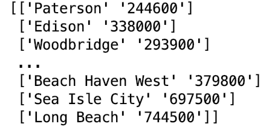

# Good-Schools
I create a numpy array of NJ cities and their corresponding median home prices (courtesy of Zillow's public data). Another column of the numpy array will involve obtaining average high school ratings in each city (based on GreatSchools or Niche rankings). Using numpy statistical functions, the correlation coefficient will be found between the features (median home prices) and labels (school ranking). A linear regression model will then be trained with sklearn to predict the average public school rating of a NJ city based on the median home price in that city

To reduce the number of confounding variables, only cities in New Jersey were used.  

The following shows the cleansed data of NJ cities and their corresponding median home prices:

